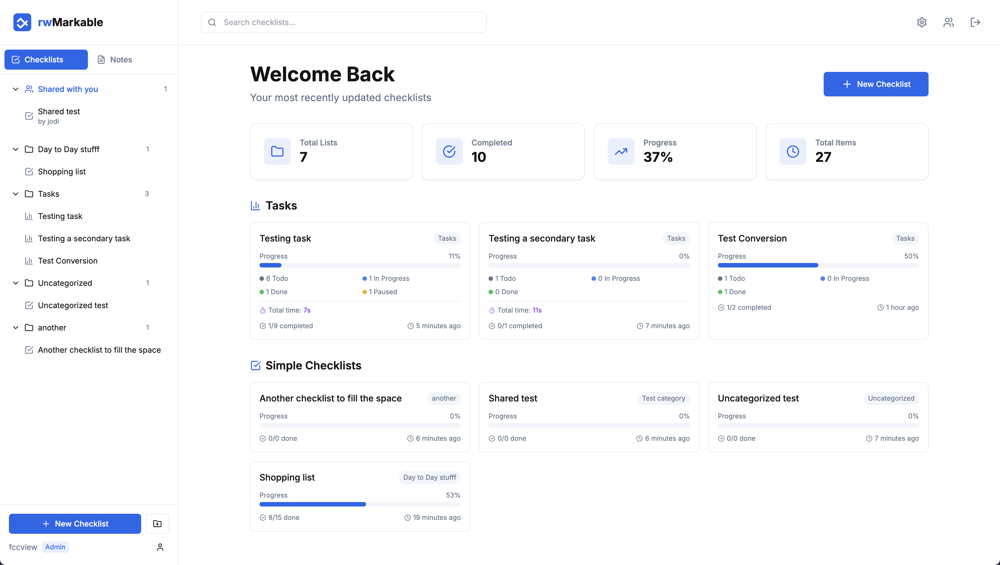
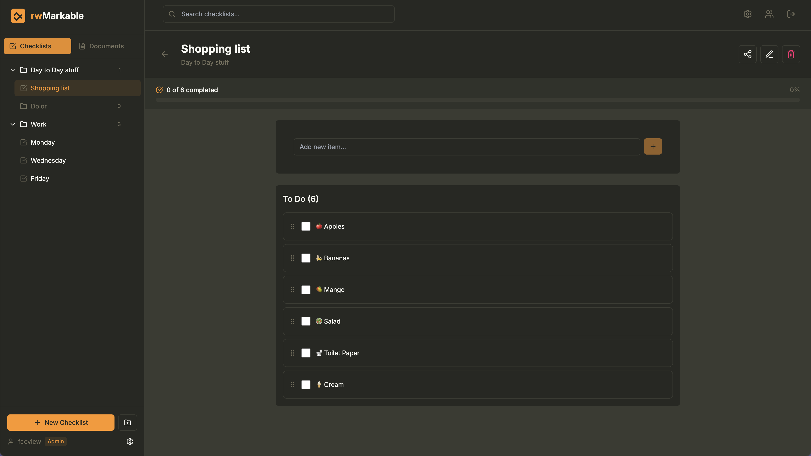
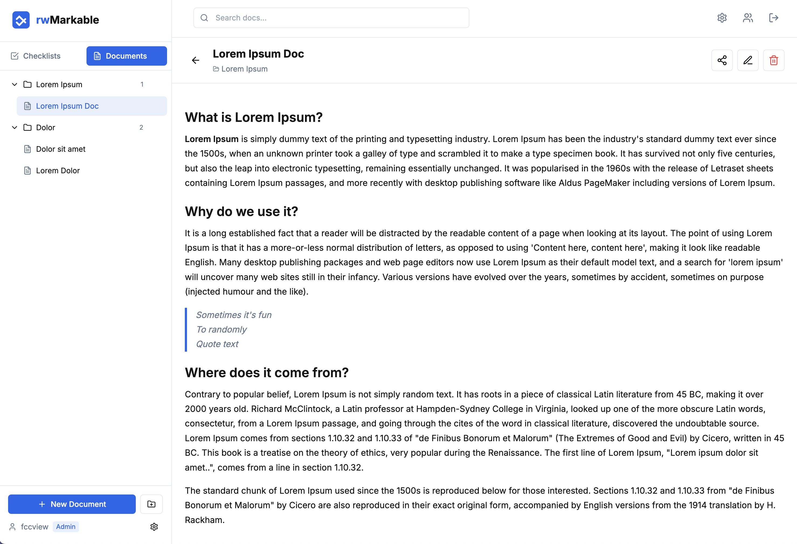

# rwMarkable

<p align="center">
  <br />
  <a href="https://www.buymeacoffee.com/fccview">
    
  </a>
</p>

A simple, self-hosted app for your checklists and notes.

Tired of bloated, cloud-based to-do apps? `rwMarkable` is a lightweight alternative for managing your personal checklists and notes. It's built with Next.js 14, is easy to deploy, and keeps all your data on your own server.

<br />

---

<p align="center">
  <a href="http://discord.gg/invite/mMuk2WzVZu">
    
  </a>
  <br />
  <i>Join the discord server for more info</i>
  <br />
</p>

---

<br />

<div align="center">
  <p align="center">
    <em>Clean, intuitive interface for managing your checklists and tasks.</em>
  </p>
  

  <p align="center">
    <em>Heavily customisable themes.</em>
  </p>
  

  <p align="center">
    <em>Rich text editor for notes and beautiful theme customization.</em>
  </p>
  
</div>

## Quick nav

- [Features](#features)
- [Tech Stack](#tech-stack)
- [Getting Started](#getting-started)
  - [Docker Compose (Recommended)](#docker-compose-recommended)
  - [Initial Setup](#initial-setup)
  - [Local Development (Without Docker)](#local-development-without-docker)
- [Data Storage](#data-storage)
- [Updating](#updating)
  - [Docker Compose](#docker-compose-1)
  - [Manual](#manual)
- [API](#api)
- [Shortcuts](#shortcuts)
- [Single Sign-On (SSO) with OIDC](#single-sign-on-sso-with-oidc)
- [Custom Themes and Emojis](#custom-themes-and-emojis)

<a id="features"></a>

## Features

- **Checklists:** Create task lists with drag & drop reordering, progress bars, and categories. Supports both simple checklists and advanced task projects with Kanban boards and time tracking.
- **Rich Text Notes:** A clean WYSIWYG editor for your notes, powered by TipTap with full Markdown support and syntax highlighting.
- **Sharing:** Share checklists or notes with other users on your instance, including public sharing with shareable links.
- **File-Based:** No database needed! Everything is stored in simple Markdown and JSON files in a single data directory.
- **User Management:** An admin panel to create and manage user accounts with session tracking.
- **Customisable:** 14 built-in themes plus custom theme support with custom emojis and icons.
- **API Access:** Programmatic access to your checklists and notes via REST API with authentication.

<a id="tech-stack"></a>

## Tech Stack

- **Framework:** Next.js 14 (App Router)
- **Language:** TypeScript
- **Styling:** Tailwind CSS
- **State:** Zustand
- **Editor:** TipTap
- **Deployment:** Docker

<a id="getting-started"></a>

## Getting Started

The recommended way to run `rwMarkable` is with Docker.

<a id="docker-compose-recommended"></a>

### Docker Compose (Recommended)

1.  Create a `docker-compose.yml` file:

    **📖 For more information about how the docker compose file works and what these variables do, please read [howto/DOCKER.md](howto/DOCKER.md)**

    ```yaml
    services:
      rwmarkable:
        image: ghcr.io/fccview/rwmarkable:latest
        container_name: rwmarkable
        user: "1000:1000"
        ports:
          - "1122:3000"
        volumes:
          - ./data:/app/data:rw
          - ./config:/app/config:ro
          - ./cache:/app/.next/cache:rw
        restart: unless-stopped
        #platform: linux/arm64
        environment:
          - NODE_ENV=production
          #- HTTPS=true
          #- SERVE_PUBLIC_IMAGES=yes
          #- SERVE_PUBLIC_FILES=yes
          #- SSO_MODE=oidc
          #- OIDC_ISSUER=<YOUR_SSO_ISSUER>
          #- OIDC_CLIENT_ID=<YOUR_SSO_CLIENT_ID>
          #- APP_URL=https://your-rwmarkable-domain.com
          #- OIDC_CLIENT_SECRET=your_client_secret
          #- SSO_FALLBACK_LOCAL=true
          #- OIDC_ADMIN_GROUPS=admins
    ```

2.  Create the data directory and set permissions:

    ```bash
    mkdir -p data/users data/checklists data/notes data/sharing cache
    sudo chown -R 1000:1000 data/
    sudo chown -R 1000:1000 cache/
    ```

    **Note:** The cache directory is optional. If you don't want cache persistence, you can comment out the cache volume line in your `docker-compose.yml`.

3.  Start the container:

    ```bash
    docker-compose up -d
    ```

The application will be available at `http://localhost:1122`.

<a id="initial-setup"></a>

### Initial Setup

On your first visit, you'll be redirected to `/auth/setup` to create your admin account if SSO is disabled, otherwise you'll be prompted to sign in via your choosen SSO provider.

Once that's done, you're ready to go! First user will be admin by default.

<a id="local-development-without-docker"></a>

### Local Development (Without Docker)

If you want to run the app locally for development:

1.  **Clone & Install:**
    ```bash
    git clone <repository-url>
    cd checklist
    yarn install
    ```
2.  **Run Dev Server:**
    ```bash
    yarn dev
    ```
    The app will be running at `http://localhost:3000`.

<a id="data-storage"></a>

## Data Storage

`rwMarkable` uses a simple file-based storage system inside the `data/` directory.

- `data/checklists/`: Stores all checklists as `.md` files.
- `data/notes/`: Stores all notes as `.md` files.
- `data/users/`: Contains `users.json` and `sessions.json`.
- `data/sharing/`: Contains `shared-items.json`.
- `data/settings.json`: App settings (name, description, custom icons).
- `data/uploads/app-icons/`: Custom uploaded app icons.

**Make sure you back up the `data` directory!**

<a id="updating"></a>

## Updating

<a id="docker-compose-1"></a>

### Docker Compose

Pull the latest image and restart your container.

```bash
docker-compose pull
docker-compose up -d
```

<a id="manual"></a>

### Manual

If you're running from source, pull the latest changes and rebuild.

```bash
git pull
yarn install
yarn build
yarn start
```

<a id="api"></a>

## API

`rwMarkable` includes a REST API for programmatic access to your checklists and notes. This is perfect for:

- **Automation:** Create tasks from external systems
- **Integrations:** Connect with other tools and services
- **Scripts:** Automate repetitive tasks
- **Dashboards:** Build custom interfaces

📖 **For the complete API documentation, see [howto/API.md](howto/API.md)**

<a id="shortcuts"></a>

## SHORTCUTS

`rwMarkable` supports a wide range of keyboard shortcuts to help you navigate and edit more efficiently without leaving the keyboard. They are divided into two main categories: global shortcuts that work anywhere in the app, and editor-specific shortcuts that work when you are writing a note.

📖 **For the complete SHORTCUTS documentation, see [howto/SHORTCUTS.md](howto/SHORTCUTS.md)**

<a id="single-sign-on-sso-with-oidc"></a>

## Single Sign-On (SSO) with OIDC

`rwMarkable` supports any OIDC provider (Authentik, Auth0, Keycloak, Okta, etc.)

📖 **For the complete SSO documentation, see [howto/SSO.md](howto/SSO.md)**

<a id="custom-themes-and-emojis"></a>

## Custom Themes and Emojis

You can easily add custom themes and emojis by creating configuration files in the `config/` directory. These will be automatically loaded and merged with the built-in themes and emojis.

📖 **For the complete customisation documentation, see [howto/CUSTOMISATIONS.md](howto/CUSTOMISATIONS.md)**

## Community shouts

I would like to thank the following members for raising issues and help test/debug them!

<table>
  <tbody>
    <tr>
      <td align="center" valign="top" width="20%">
        <a href="https://github.com/fruiz1972"><br/>fruiz1972</a>
      </td>
      <td align="center" valign="top" width="20%">
        <a href="https://github.com/seigel"><br />seigel</a>
      </td>
      <td align="center" valign="top" width="20%">
        <a href="https://github.com/mariushosting"><br />mariushosting</a>
      </td>
      <td align="center" valign="top" width="20%">
        <a href="https://github.com/Isotop7"><br />Isotop7</a>
      </td>
      <td align="center" valign="top" width="20%">
        <a href="https://github.com/bluegumcity"><br />bluegumcity</a>
      </td>
    </tr>
    <tr>
      <td align="center" valign="top" width="20%">
        <a href="https://github.com/IGOLz"><br/>IGOLz</a>
      </td>
      <td align="center" valign="top" width="20%">
        <a href="https://github.com/floqui-nl"><br />floqui-nl</a>
      </td>
      <td align="center" valign="top" width="20%">
        <a href="https://github.com/davehope"><br />davehope</a>
      </td>
      <td align="center" valign="top" width="20%">
        <a href="https://github.com/Sku1ly"><br />Sku1ly</a>
      </td>
      <td align="center" valign="top" width="20%">
        <a href="https://github.com/ItsNoted"><br />ItsNoted</a>
      </td>
    </tr>
    <tr>
      <td align="center" valign="top" width="20%">
        <a href="https://github.com/red-bw"><br/>red-bw</a>
      </td>
      <td align="center" valign="top" width="20%">
        <a href="https://github.com/kn0rr0x"><br />kn0rr0x</a>
      </td>
      <td align="center" valign="top" width="20%">
        <a href="https://github.com/mroovers"><br />mroovers</a>
      </td>
      <td align="center" valign="top" width="20%">
        <a href="https://github.com/Ryderjj89"><br />Ryderjj89</a>
      </td>
      <td align="center" valign="top" width="20%">
        <a href="https://github.com/spaghetti-coder"><br />spaghetti-coder</a>
      </td>
    </tr>
    <tr>
      <td align="center" valign="top" width="20%">
        <a href="https://github.com/hurleyy"><br />hurleyy</a>
      </td>
      <td align="center" valign="top" width="20%">
        <a href="https://github.com/schneider-de-com"><br />schneider-de-com</a>
      </td>
      <td align="center" valign="top" width="20%">
        <a href="https://github.com/zolakt"><br />zolakt</a>
      </td>
      <td align="center" valign="top" width="20%">
        <a href="https://github.com/Justus0405"><br />Justus0405</a>
      </td>
    </tr>
  </tbody>
</table>

## License

This project is licensed under [MIT License](LICENSE).

## Support

For issues and questions, please open an issue on the GitHub repository.

## Star History

[](https://www.star-history.com/#fccview/rwmarkable&Date)
